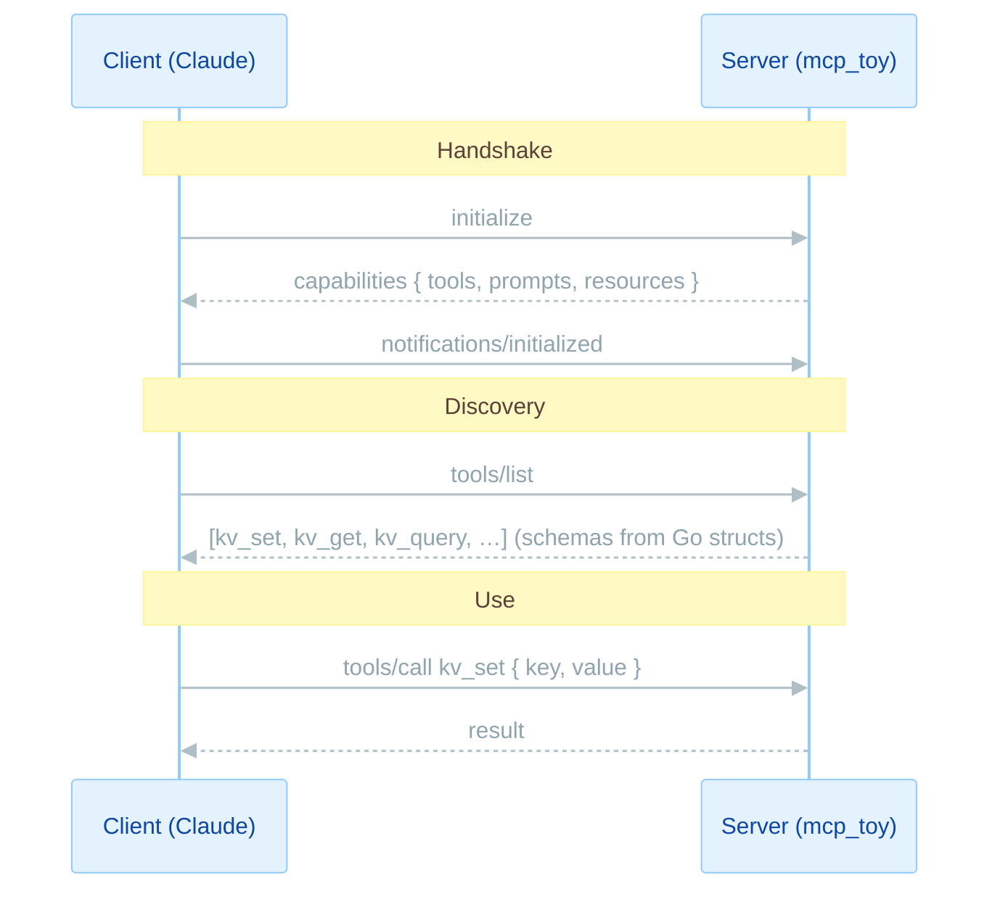
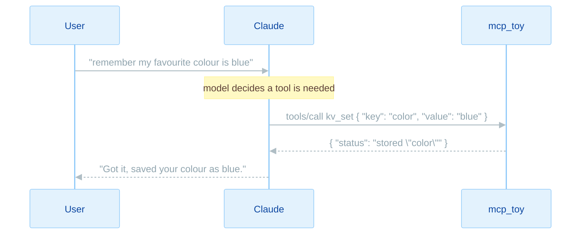
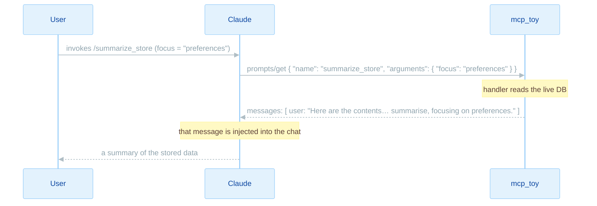
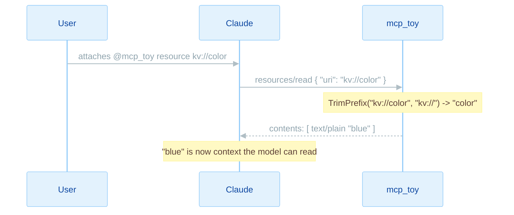

# mcp_toy

A tiny, heavily-commented [Model Context Protocol](https://modelcontextprotocol.io) (MCP) server in Go. It hands an AI client (Claude Code, Claude Desktop, Cursor, …) a SQLite-backed key/value store through all three MCP primitives: **tools**, **prompts**, and **resources**.

It exists to be *read*. If you've never built an MCP server, this is a complete, working one small enough to understand end to end.

---

## Quick start

```bash
# 1. clone + enter
git clone https://github.com/pixperk/mcp_toy && cd mcp_toy

# 2. build (single self-contained binary, no cgo)
go build -o mcp_toy ./cmd/mcp_toy

# 3. poke it without any AI; the MCP Inspector gives you a clickable UI
npx @modelcontextprotocol/inspector ./mcp_toy
```

To use it from **Claude Code**, the bundled [`.mcp.json`](.mcp.json) is auto-discovered; just reload the window and approve the server. Then talk to it:

> "store my favourite colour as blue" → it calls `kv_set`
> "what keys do I have?" → it calls `kv_list`

To use it from **Claude Desktop**, add to `~/Library/Application Support/Claude/claude_desktop_config.json` and restart:

```json
{ "mcpServers": { "mcp_toy": { "command": "/absolute/path/to/mcp_toy" } } }
```

> An MCP stdio server is **not** meant to be run by hand. If you just `./mcp_toy` it sits silently waiting for JSON-RPC on stdin. That's correct; it's designed to be launched by a client.

---

## What you get

### Tools: functions the model calls to *act*

| Tool | Description |
|------|-------------|
| `kv_set` | Store a value under a key (overwrites). |
| `kv_get` | Look up the value for a key. |
| `kv_delete` | Delete a key. |
| `kv_list` | List all keys, sorted. |
| `kv_query` | Run a **read-only** `SELECT`/`WITH` SQL query against the `kv` table. |

### Prompts: reusable templates the *user* invokes

| Prompt | Description |
|--------|-------------|
| `summarize_store` | Reads the current store and templates it into a "please summarise this" message. Optional `focus` argument. |

### Resources: read-only data the client *attaches* as context

| URI | Description |
|-----|-------------|
| `kv://all` | The entire store as one JSON object. |
| `kv://{key}` | The value under one key, as plain text (a resource *template*). |

---

## How MCP actually works

Under the hood, MCP is just **JSON-RPC 2.0** messages over a transport. This server uses the **stdio** transport: the client launches the binary as a subprocess and pipes messages over stdin/stdout. (Because stdout *is* the protocol channel, all logging goes to stderr; writing to stdout would corrupt the stream. See [`cmd/mcp_toy/main.go`](cmd/mcp_toy/main.go).)

Every session opens with a handshake, then the client discovers and uses capabilities:



The three primitives differ in **who initiates** them and **what they're for**:

| Primitive | Mental model | Initiated by | Discover / use methods |
|-----------|-------------|--------------|------------------------|
| **Tool** | a function the AI calls to *act* | the **model**, mid-conversation | `tools/list` → `tools/call` |
| **Prompt** | a canned message the user drops in (like a slash command) | the **user** | `prompts/list` → `prompts/get` |
| **Resource** | data the client pulls in as context | the **user/client** | `resources/list` (+ `resources/templates/list`) → `resources/read` |

---

## How each primitive is invoked, end to end

### Tools

1. On connect, the client calls `tools/list`. The server returns each tool's name, description, and a **JSON Schema** for its arguments.
2. The model reads those descriptions and decides, on its own, to call one, emitting `tools/call` with a name and arguments.
3. The SDK validates the arguments against the schema, **parses them into your Go struct**, and invokes your handler.
4. Your handler returns a typed result; the SDK serialises it back.

The magic is that you never write a schema by hand. The SDK reflects over your input/output structs and the `jsonschema` tags become the descriptions the model sees ([`internal/handlers/handlers.go`](internal/handlers/handlers.go)):

```go
type SetInput struct {
    Key   string `json:"key" jsonschema:"the key to store the value under"`
    Value string `json:"value" jsonschema:"the value to store"`
}

func (h *Handlers) set(ctx context.Context, _ *mcp.CallToolRequest, in SetInput) (*mcp.CallToolResult, SetOutput, error) {
    if err := h.Store.Set(ctx, in.Key, in.Value); err != nil {
        return nil, SetOutput{}, fmt.Errorf("set failed: %w", err)
    }
    return nil, SetOutput{Status: fmt.Sprintf("stored %q", in.Key)}, nil
}

mcp.AddTool(server, &mcp.Tool{Name: "kv_set", Description: "Store a value under a key."}, h.set)
```

Returning a non-nil `error` tells the model the tool *failed*, and the message is surfaced to it; that's how `kv_query` reports a blocked query.



**What the AI actually invokes.** When the user says *"remember my favourite colour is blue"*, the model emits:

```json
{ "method": "tools/call",
  "params": { "name": "kv_set", "arguments": { "key": "color", "value": "blue" } } }
```

and the server replies:

```json
{ "result": { "structuredContent": { "status": "stored \"color\"" } } }
```

Later, *"what colours do I have stored?"* might make the model reach for `kv_query` instead of `kv_get`, because the description says it's for filtering the model can't express otherwise:

```json
{ "method": "tools/call",
  "params": { "name": "kv_query",
              "arguments": { "sql": "SELECT key, value FROM kv WHERE key LIKE '%colo%'" } } }
```

### Prompts

1. The client calls `prompts/list`; the server returns each prompt's name, description, and declared arguments.
2. The **user** picks one (in Claude Code it shows up like `/mcp__mcp_toy__summarize_store`) and supplies arguments.
3. The client calls `prompts/get`; your handler builds and returns the actual message(s) to seed the conversation.

A prompt handler can do real work: `summarize_store` reads the **live** database and templates its contents in:

```go
func (h *Handlers) summarizeStore(ctx context.Context, req *mcp.GetPromptRequest) (*mcp.GetPromptResult, error) {
    focus := req.Params.Arguments["focus"]      // optional templating argument
    data, _ := h.Store.All(ctx)                 // pull live data
    text := buildSummaryRequest(data, focus)
    return &mcp.GetPromptResult{
        Messages: []*mcp.PromptMessage{{Role: "user", Content: &mcp.TextContent{Text: text}}},
    }, nil
}
```



**What the user invokes.** Unlike a tool, the *user* triggers a prompt. The client sends:

```json
{ "method": "prompts/get",
  "params": { "name": "summarize_store", "arguments": { "focus": "preferences" } } }
```

and the server returns a ready-to-send message that already contains the live data:

```json
{ "result": { "messages": [
  { "role": "user",
    "content": { "type": "text",
      "text": "Here are the current contents of the key/value store:\n- color = blue\n- food = sushi\n\nPlease summarise what this data represents, focusing on: preferences." } }
] } }
```

**From the user's side**, in Claude Code you invoke it as a slash command (server-prefixed):

```text
/mcp__mcp_toy__summarize_store
/mcp__mcp_toy__summarize_store focus="preferences"
```

In Claude Desktop it appears in the prompt picker (the `+` / "Add from mcp_toy" menu) as **summarize_store**, with a field to fill in `focus`.

### Resources

1. The client calls `resources/list` (fixed resources) and `resources/templates/list` (parameterised ones).
2. The **user/client** chooses a resource to attach as context.
3. The client calls `resources/read` with a URI; your handler returns the contents.

This server exposes one fixed resource and one template. For the template, the requested key is parsed out of the URI, and a miss returns a proper not-found error:

```go
func (h *Handlers) resourceByKey(ctx context.Context, req *mcp.ReadResourceRequest) (*mcp.ReadResourceResult, error) {
    key := strings.TrimPrefix(req.Params.URI, "kv://")   // kv://color -> color
    value, found, err := h.Store.Get(ctx, key)
    if err != nil { return nil, err }
    if !found { return nil, mcp.ResourceNotFoundError(req.Params.URI) }
    return &mcp.ReadResourceResult{
        Contents: []*mcp.ResourceContents{{URI: req.Params.URI, MIMEType: "text/plain", Text: value}},
    }, nil
}

server.AddResource(&mcp.Resource{URI: "kv://all", Name: "store_snapshot", MIMEType: "application/json"}, h.resourceAll)
server.AddResourceTemplate(&mcp.ResourceTemplate{URITemplate: "kv://{key}", Name: "store_value"}, h.resourceByKey)
```



**What the client invokes.** Resources are attached, not called. The client sends a URI:

```json
{ "method": "resources/read", "params": { "uri": "kv://color" } }
```

and the server returns the contents (a miss returns a not-found error instead):

```json
{ "result": { "contents": [
  { "uri": "kv://color", "mimeType": "text/plain", "text": "blue" }
] } }
```

**From the user's side**, you pull a resource into context with an `@` mention:

```text
@mcp_toy                       # opens the resource picker for this server
@mcp_toy:kv://all              # attach the whole store as JSON context
@mcp_toy:kv://color            # attach just one key's value
```

In Claude Desktop, click the 🔌 / paperclip and pick a resource from **mcp_toy** to attach it to the message.

---

## How it was built, step by step

The project grew in deliberate stages, each one a self-contained, working server:

1. **Hello MCP.** One `greet` tool over stdio, to confirm the client could talk to a Go binary at all. Pure mechanics: `mcp.NewServer` → `mcp.AddTool` → `server.Run(ctx, &mcp.StdioTransport{})`.
2. **A real database.** Swapped the toy logic for a SQLite-backed key/value store using the pure-Go `modernc.org/sqlite` driver (no cgo). Tools became `kv_set` / `kv_get` / `kv_delete` / `kv_list`.
3. **Untrusted SQL.** Added `kv_query`, letting the model write its own `SELECT`s, which forced the question of *guarding AI input* (see below).
4. **Structure.** Split the single file into a `cmd/` entrypoint plus `internal/store` (all SQL) and `internal/handlers` (all MCP wiring), so state is explicit and each layer has one job.
5. **Prompts.** Added `summarize_store`, a template that reads live data, the second primitive.
6. **Resources.** Added `kv://all` and the `kv://{key}` template, the third primitive, completing the set.

Each stage was verified by piping a raw JSON-RPC handshake straight into the binary and checking the responses, long before any AI was involved.

---

## Project layout

```
.
├── cmd/mcp_toy/main.go           # entrypoint: open store, build + run server over stdio
├── internal/store/store.go       # all SQL: Set/Get/Delete/List/All/Query + the read-only guard
├── internal/handlers/handlers.go # all MCP wiring: tool, prompt + resource handlers and registration
├── .mcp.json                     # client config for Claude Code (uses `go run`, so it's portable)
└── go.mod
```

The `store` package owns every SQL statement; the `handlers` package owns every MCP detail. Nothing else touches the database directly.

---

## Security note: the read-only guard

`kv_query` lets the model write SQL, which is untrusted input. `guardReadOnly` (in [`internal/store/store.go`](internal/store/store.go)) rejects anything that isn't a single `SELECT`/`WITH` statement, blocks statement-stacking (`SELECT 1; DROP TABLE kv`), and denies mutating keywords.

This guard is a **speed bump, not a wall**; it's string matching, not a SQL parser, so it can produce false positives (a query mentioning `update` inside a string literal gets rejected). The robust layer is making the database physically unable to write, e.g. opening the connection with `?mode=ro` or `?_pragma=query_only(true)`. Treat AI-supplied SQL as hostile and enforce read-only at the engine level for anything beyond a toy.

---

## Requirements

- Go 1.26+
- No cgo (uses pure-Go [`modernc.org/sqlite`](https://pkg.go.dev/modernc.org/sqlite))

### Flags

| Flag | Default | Description |
|------|---------|-------------|
| `-db` | `file:mcp_toy.db?_pragma=busy_timeout(5000)` | SQLite DSN. Use `file::memory:?cache=shared` for an ephemeral store. |

### Raw smoke test

Drive the server directly to confirm it's alive (no client needed):

```bash
printf '%s\n' \
'{"jsonrpc":"2.0","id":1,"method":"initialize","params":{"protocolVersion":"2025-06-18","capabilities":{},"clientInfo":{"name":"t","version":"0"}}}' \
'{"jsonrpc":"2.0","method":"notifications/initialized"}' \
'{"jsonrpc":"2.0","id":2,"method":"tools/list"}' \
; sleep 1 | ./mcp_toy
```
